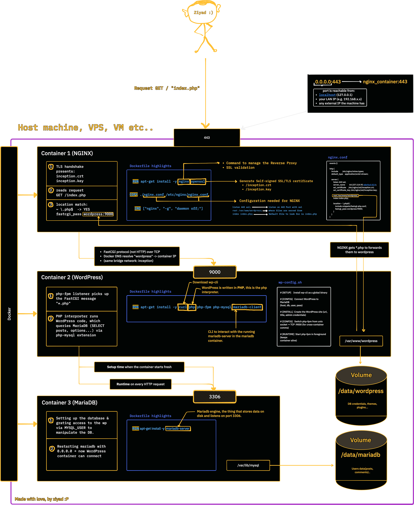
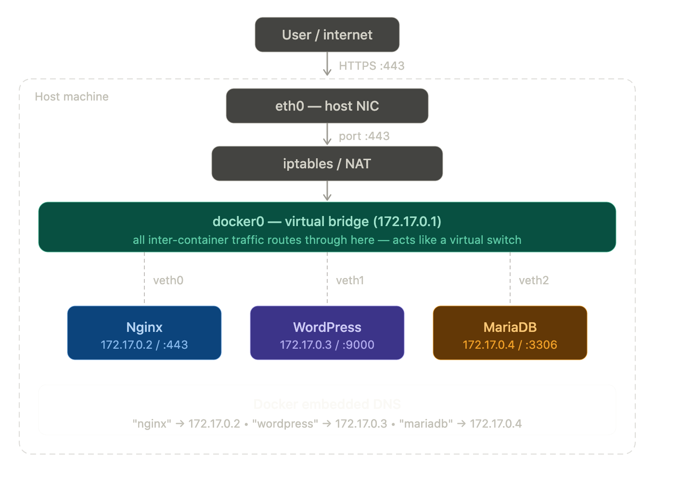

<div align="center">


## Overview

Small web infrastructure with **Docker Compose**, **NGINX**, **WordPress + PHP-FPM**, and **MariaDB**, hand-built from `debian:bookworm`, wired on a private bridge network reachable only through **TLS on port 443**(Port 80 is CLOSED, HTTP does not exist here :P). No pre-built images, no `latest` tags.


---

# Architecture



</div>

---

# Docker networking: how containers communicate ?

through **docker0**, its basically the default virtual bridge Docker creates on the host. Its role:

- Assigns IPs to each container (172.17.0.x)
- Routes traffic between containers (nginx → wordpress → mariadb all go through it)
- Entry point for incoming traffic from the host via iptables
- Isolates containers from the rest of the host network

We can say in one line that it's the virtual switch that makes containers able to talk to each other and to the outside world, take a look at this:

<div align="center">
  
</div>

---

## Startup Order

```
make up
  |
  +-- mkdir /root/data/wordpress   (host volume dirs)
  +-- mkdir /root/data/mariadb
  |
  +--> mariadb container starts
  |       mariadb.sh runs:
  |         1. start service (setup mode)
  |         2. create DB + user + grant
  |         3. stop service
  |         4. launch mysqld_safe with 0.0.0.0 so other containers can communicate with mariadb (foreground, PID 1)
  |       healthcheck: mysqladmin ping every 7s
  |
  +--> wordpress container starts  (waits: mariadb healthy)
  |       wp-config.sh runs:
  |         1. download wp-cli
  |         2. if no wp-config.php:
  |              wp core download
  |              wp core config  (points to mariadb:3306)
  |              wp core install (creates admin + editor users)
  |         3. patch php-fpm to listen on 0.0.0.0:9000
  |         4. launch php-fpm8.2 -F (foreground, PID 1)
  |
  +--> nginx container starts  (waits: wordpress up)
          Dockerfile baked a self-signed cert at build time
          nginx.conf: listen 443 ssl, forward *.php -> wordpress:9000
          CMD: nginx -g "daemon off;" (foreground, PID 1)
```

---

## File Map

```
sysadmin-orbit/
├── Makefile                        <- build/run/clean commands
├── srcs/
│   ├── docker-compose.yml          <- networks, volumes, services
│   ├── .env                        <- secrets (git-ignored)
│   ├── .env.example                <- template for .env
│   └── requirements/
│       ├── mariadb/
│       │   ├── Dockerfile          <- installs mariadb-server
│       │   └── tools/mariadb.sh   <- init DB + run mysqld_safe
│       ├── nginx/
│       │   ├── Dockerfile          <- installs nginx + openssl, bakes TLS cert
│       │   └── nginx.conf          <- server config (443 ssl, fastcgi)
│       └── wordpress/
│           ├── Dockerfile          <- installs php-fpm, php-mysql, curl
│           └── wp-config.sh        <- wp-cli install + run php-fpm
```

---

## Volumes & Data Persistence

```
Host path               Docker volume name   Mounted in
/root/data/mariadb  --> mariadb (bind)    --> mariadb:/var/lib/mysql
/root/data/wordpress -> wordpress (bind)  --> wordpress:/var/www/wordpress
                                          --> nginx:/var/www/wordpress (read)
```

Both volumes use `driver: local` with `o: bind` — they are plain host directories
bind-mounted into the containers. Data survives `docker compose down` but is wiped
by `make fclean` (which does `rm -rf /root/data`).

---

## .env Variables

| Variable           | Used by        | Purpose                          |
|--------------------|----------------|----------------------------------|
| `MYSQL_DB`         | MariaDB, WP    | Database name                    |
| `MYSQL_USER`       | MariaDB, WP    | DB user WordPress connects as    |
| `MYSQL_PASSWORD`   | MariaDB, WP    | Password for that user           |
| `DOMAIN_NAME`      | WordPress      | Site URL (e.g. https://IP)       |
| `WP_TITLE`         | WordPress      | Site title                       |
| `WP_ADMIN_N/P/E`   | WordPress      | Admin username / password / email|
| `WP_U_NAME/EMAIL/PASS/ROLE` | WordPress | Second (editor) user        |

`.env` is git-ignored. Copy `.env.example` and fill in real values.

---

## Makefile Commands

| Command      | What it does                                                      |
|--------------|-------------------------------------------------------------------|
| `make build` | Creates `/root/data/{wordpress,mariadb}`, then `docker compose build` |
| `make up`    | `build` + `docker compose up -d`                                  |
| `make down`  | `docker compose down -v --rmi all` (stops, removes volumes+images)|
| `make clean` | `down` + `docker system prune -af`                                |
| `make fclean`| `down` + prune + `rm -rf /root/data` (wipes all data)             |
| `make re`    | `clean` + `build` + `up` (full rebuild from scratch)              |

---

## Key Rules (42 constraints)

- One service per container — no putting two processes in one image.
- No `latest` tags — all images tagged `:42`.
- No `network: host` or `--privileged`.
- Every service runs as PID 1 in the foreground (no `daemon on`).
- Port 80 is never opened — HTTP does not exist.
- Secrets live in `.env`, never baked into Dockerfiles.
- WordPress only starts after MariaDB passes its `mysqladmin ping` healthcheck.
