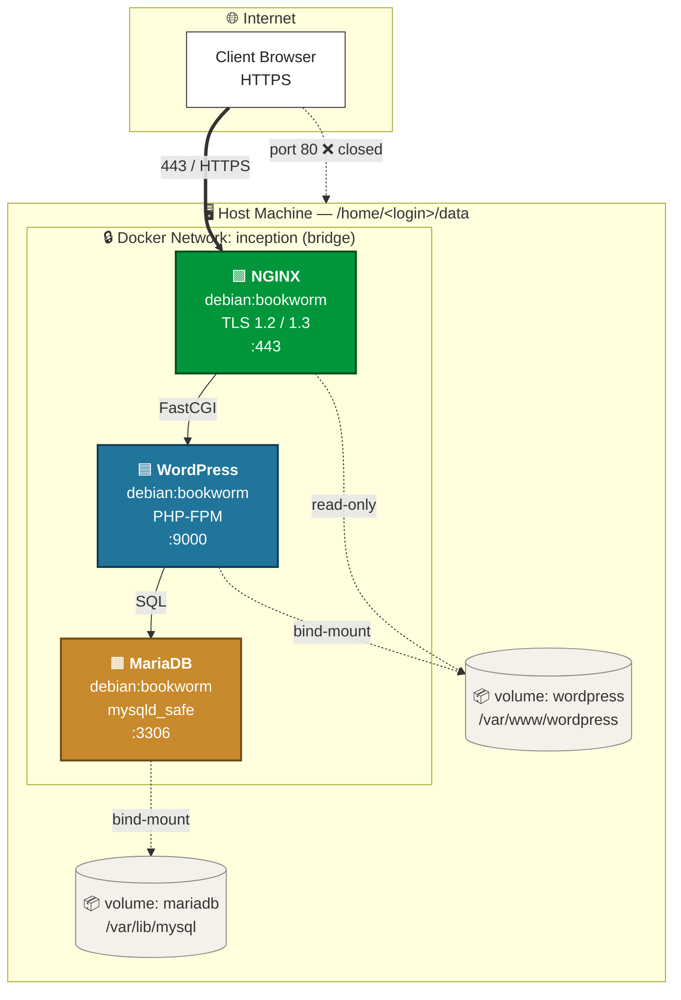

<div align="center">


## Overview

A 42 project that builds a small web infrastructure with **Docker Compose**, **NGINX**, **WordPress + PHP-FPM**, and **MariaDB** — each service in its own hand-built container, wired on a private network, reachable only through **TLS on port 443**.

</div>


## Architecture



## Core Rules

One service per container · no `latest` tags · no `network: host` · services run as **PID 1** in the foreground · only port **443** is exposed (TLS 1.2/1.3) · secrets live in `.env`.

---

## Project Structure

```
Inception/
├── Makefile
└── srcs/
    ├── docker-compose.yml
    ├── .env                             # you create this
    └── requirements/
        ├── mariadb/{Dockerfile,tools/mariadb.sh}
        ├── nginx/{Dockerfile,nginx.conf}
        └── wordpress/{Dockerfile,WpConfig.sh}
```

---

## Getting Started

```bash
git clone https://github.com/2iaad/Inception.git && cd Inception

# create srcs/.env

# point the domain at localhost
echo "127.0.0.1 zderfouf.42.fr" | sudo tee -a /etc/hosts

make build && make up
```

Open **https://zderfouf.42.fr** → accept the self-signed cert → you're in.

---

## Makefile & Env

| Target       | Action                                           |
| ------------ | ------------------------------------------------ |
| `make build` | Creates host volumes and builds all three images |
| `make up`    | Starts the stack in detached mode                |
| `make down`  | Stops stack, removes volumes and images          |
| `make clean` | `docker system prune -af`                        |

**`.env` keys:** `DOMAIN_NAME` · `MYSQL_DB/USER/PASSWORD/ROOT_PASSWORD` · `WP_TITLE` · `WP_ADMIN_N/P/E` · `WP_U_NAME/EMAIL/PASS/ROLE`

---

## Services

| Service       | Role                                            |
| ------------- | ----------------------------------------------- |
| **NGINX**     | TLS termination on `443`, FastCGI → WordPress   |
| **WordPress** | PHP-FPM on `:9000`, bootstrapped via **wp-cli** |
| **MariaDB**   | DB store, `mysqladmin ping` healthcheck         |

## Security Highlights

The stack is HTTPS-only (port 80 stays closed), runs on a private bridge network where only NGINX is exposed, keeps secrets in `.env` instead of baking them into image layers, stores data on host-bound volumes so it survives `down`, and starts WordPress only after MariaDB passes its healthcheck.

---

<div align="center">

**Ziyad** · @ 42 Network

<sub>Built at 42 · Debian Bookworm · Docker Compose v2</sub>

</div>
